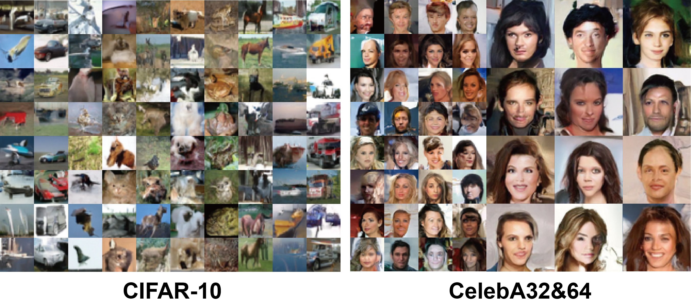

# PRIVIMAGE
PRIVIMAGE is a Differetial Privacy (DP) image generation tool, which leverages the DP technique to generate synthetic data to replace the sensitive data, allowing organizations to share and utilize synthetic images without privacy concerns.

# Requirements
PRIVIMAGE is built using PyTorch 2.0.1 and CUDA 11.8. Please use the following command to install the requirements:
```
conda install pytorch==2.0.1 torchvision==0.15.2 torchaudio==2.0.2 pytorch-cuda=11.8 -c pytorch -c nvidia
pip install -r requirements.txt 
```
# Repoduction
We provide an example for how to repoduce the results on CIFAR-10 in our paper. Suppose you had 4 GPUs on your device.
## Data preparations
Download and preprocess CIFAR-10 and ImageNet dataset.
```
# download CIFAR-10 and save it as /data_dir/cifar-10-python.tar.gz
# download ImageNet and save it as a folder /data_dir/imagenet
cd /src/PRIVIMAGE+D
# preprocess CIFAR-10
python dataset_tool.py --source /data_dir/cifar-10-python.tar.gz --dest /data_dir/cifar10.zip
python compute_fid_statistics.py --path /data_dir/cifar10.zip --file /data_dir/cifar10.npz
# prepocess ImageNet and save it as a folder /data_dir/imagenet32
sh pd.sh
```
## Query semantic distribution
Train a semantic query function on the public dataset ImageNet.
```
cd /src/SemanticQuery
CUDA_VISIBLE_DEVICES=0,1,2,3 torchrun --nproc_per_node=4 --nnodes=1 train_imagenet_classifier.py
```
After training, the checkpoints will be saved with the according accuracy on the validate set. You can choose the checkpoint with the highest accuracy to query the semantics. Also you can use our trained checkpoints.
```
python query_semantics.py --weight_file weight_path --tar_dataset cifar10 --data_dir /data_dir/ --num_words 5 --sigma1 484 --tar_num_classes 10
```
The query result will be saved as a .pth file into the folder /QueryResults
## Pre-training
You need change data_dir parameters into yours in /src/Pre-training/configs/cifar10_32/pretrain_s.yaml
```
cd /src/Pre-training
CUDA_VISIBLE_DEVICES=0,1,2,3 python main.py --mode train --worker_dir pt_dir
```
After training, the checkpoint will be saved as /src/Pre-training/pt_dir/checkpoints/final_checkpoint.pth
## Fine-tuning
You need change data_dir and ckpt parameters into yours in /src/PRIVIMAGE+D/configs/cifar10_32/train_eps_10.0_s.yaml
```
cd /src/PRIVIMAGE+D
CUDA_VISIBLE_DEVICES=0,1,2,3 python main.py --mode train --worker_dir ft_dir
```
The FID of synthetic images will be saved in /src/PRIVIMAGE/ft_dir/stdout.txt
## Evaluation
Use trained PRIVIMAGE to generate 50,000 images for training classifiers.
```
CUDA_VISIBLE_DEVICES=0,1,2,3 python main.py --mode eval --worker_dir ft_dir/sample50000 -- model.ckpt=/src/PRIVIMAGE+D/ft_dir/checkpoints/final_checkpoint.pth
cd /src/Evaluation
python downstream_classification.py --out_dir /src/PRIVIMAGE+D/ft_dir --train_dir /src/PRIVIMAGE+D/ft_dir/sample50000/samples --test_dir data_dir --dataset cifar10
```
The Classification Accuracy of trained classifiers on the testset will be saved into /src/PRIVIMAGE+D/ft_dir/evaluation_downstream_acc_log.txt
# Acknowledgement
The code for training the diffusion models with DP-SGD is based on the [DPDM](https://github.com/nv-tlabs/DPDM).
