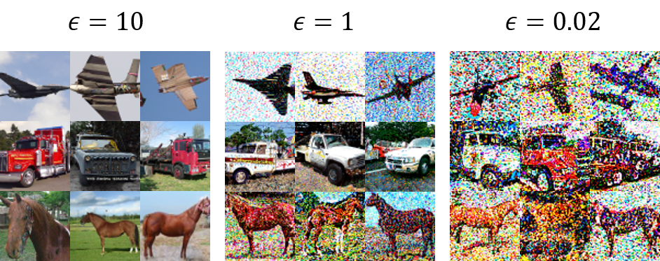

# DP-Image-Generation
Image generation via private embedding and diffusion model
## Public Dataset: ImageNet, Private Dataset: CIFAR10
Test accuracies (higher is better) of ResNet9 trained on CIFAR-10 synthetic data with varying privacy
guarantees. When trained on real data, test accuracy is 88.3%.
|           | e=10 |  e=1 | e=0.2 |
|-----------|:----:|:----:|:-----:|
| DP-MEPF-1 | 48.9 | 28.9 |  12.4 |
| DP-MEPF-2 | 51.0 | 29.4 |  13.8 |
| Ours      | 63.3 | 48.3 |  24.7 |

Synthetic CIFAR10 samples generated at different levels of privacy.

 

