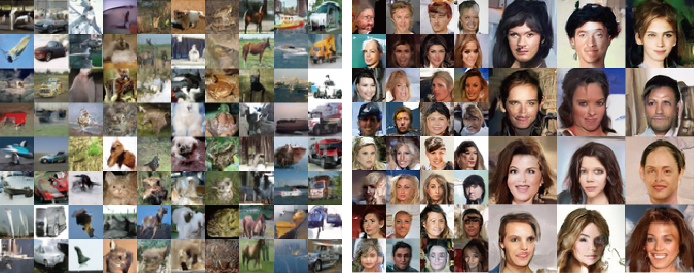

<div align=center>
  
# PrivImage: Differentially Private Synthetic Image Generation using Diffusion Models with Semantic-Aware Pretraining
</div>

This is the official implementaion of paper [***PrivImage: Differentially Private Synthetic Image Generation using Diffusion Models with Semantic-Aware Pretraining***](https://arxiv.org/abs/2311.12850), which is accepted in ***USENIX Security 2024***. This repository contains Pytorch training code and evaluation code. PrivImage is a Differetial Privacy (DP) image generation tool, which leverages the DP technique to generate synthetic data to replace the sensitive data, allowing organizations to share and utilize synthetic images without privacy concerns.

<div align=center>

</div>

<p align="center">Synthetic images from PrivImage on CIFAR-10 and CelebA32&64 with $\epsilon=10$.</p>

## Update:

- 10/07/2024: We reached out to the author of DPSDA and have added an explanation for why the FID scores in the DPSDA table are lower than those reported in the original paper. Please refer to [Paper](https://arxiv.org/abs/2311.12850).

## 1. Contents
- PrivImage: Differentially Private Synthetic Image Generation using Diffusion Models with Semantic-Aware Pretraining
  - [1. Contents](#1-contents)
  - [2. Introduction](#2-introduction)
  - [3. Get Start](#3-get-start)
    - [3.1 Installation](#31-installation)
    - [3.2 Dataset and Files Preparation](#32-dataset-and-files-preparation)
    - [3.3 Training](#33-training)
    - [3.4 Inference](#34-inference)
  - [4. Contacts](#4-contacts)
  - [5. Acknowledgment](#5-acknowledgment)
  - [6. Citation](#6-citation)

## 2. Introduction

Differential Privacy (DP) image data synthesis, which leverages the DP technique to generate synthetic data to replace the sensitive data, allowing organizations to share and utilize synthetic images without privacy concerns. Previous methods incorporate the advanced techniques of generative models and pre-training on a public dataset to produce exceptional DP image data, but suffer from problems of unstable training and massive computational resource demands. This paper proposes a novel DP image synthesis method, termed PrivImage, which meticulously selects pre-training data, promoting the efficient creation of DP datasets with high fidelity and utility. PrivImage first establishes a semantic query function using a public dataset. Then, this function assists in querying
the semantic distribution of the sensitive dataset, facilitating the selection of data from the public dataset with analogous semantics for pre-training. Finally, we pre-train an image generative model using the selected data and then fine-tune this model on the sensitive dataset using Differentially Private Stochastic Gradient Descent (DP-SGD). PrivImage allows us to train a lightly parameterized generative model, reducing the noise in the gradient during DP-SGD training and enhancing training stability. Extensive experiments demonstrate that PRIVIMAGE uses only 1% of the public dataset for pre-training and 7.6% of the parameters in the generative model compared to the state-of-the-art method, whereas achieves superior synthetic performance and conserves more computational resources. On average, PrivImage achieves 6.8% lower FID and 13.2% higher Classification Accuracy than the state-of-the-art method.

## 3. Get Start
We provide an example for how to reproduce the results on CIFAR-10 in our paper. Suppose you had 4 GPUs on your device.

### 3.1 Installation

To setup the environment of PRIVIMAGE, we use `conda` to manage our dependencies. Our developers are conducted using `CUDA 11.8`. 

Run the following commands to install PrivImage:
 ```
conda create -n privimage python=3.8 -y && conda activate privimage
pip install --upgrade pip
pip install pytorch==2.0.1 torchvision==0.15.2 torchaudio==2.0.2 pytorch-cuda=11.8 -c pytorch -c nvidia
pip install -r requirements.txt 
 ```

### 3.2 Dataset and Files Preparation
Download the files in the table and arrange the files according to the file tree below.
  | Dataset & Files                        | Download                                                               | Usage                                                                 |
  | -------------------------------------- | ---------------------------------------------------------------------- | --------------------------------------------------------------------- |
  | data/ImageNet_ILSVRC2012             | [Official Link](http://image-net.org/)                        | Pretraining dataset                                                     |
  | data/CIFAR-10                   | [Google Drive](https://drive.google.com/file/d/1pSwaN0Tn7Y2D6EOpkj3A1N8LEYR277Aw/view?usp=drive_link)      | Sensitive dataset                                        |

```text
    |--src/
      |--data/
        |--ImageNet_ILSVRC2012/
           |--train/
             |--n01440764/
             |--n01443537/
             ...
           |--val/
             |--n01440764/
             |--n01443537/
             ...
        |--CIFAR-10
           |--cifar-10-python.tar.gz
```
Preprocess dataset for faster training.
```
cd /src/PRIVIMAGE+D
# preprocess CIFAR-10
python dataset_tool.py --source /src/data/CIFAR-10/cifar-10-python.tar.gz --dest /src/data/CIFAR-10/cifar10.zip
python compute_fid_statistics.py --path /src/data/CIFAR-10/cifar10.zip --file /src/data/CIFAR-10/cifar10.npz
# preprocess ImageNet and save it as a folder /src/data/ImageNet32_ILSVRC2012
sh pd.sh
```

### 3.3 Training
First, train a semantic query function on the public dataset ImageNet.
```
cd /src/SemanticQuery
CUDA_VISIBLE_DEVICES=0,1,2,3 torchrun --nproc_per_node=4 --nnodes=1 train_imagenet_classifier.py
```
After training, the checkpoints will be saved with the according accuracy on the validate set. You can choose the checkpoint with the highest accuracy to query the semantics.
```
python query_semantics.py --weight_file weight_path --tar_dataset cifar10 --data_dir /src/data/CIFAR-10 --num_words 5 --sigma1 484 --tar_num_classes 10
```
The query result will be saved as a `.pth` file into the folder `/QueryResults`.

Second, pretrain the diffusion model with the query result. Please change data_dir parameters into yours in `/src/Pre-training/configs/cifar10_32/pretrain_s.yaml`.
```
cd /src/Pre-training
CUDA_VISIBLE_DEVICES=0,1,2,3 python main.py --mode train --worker_dir pt_dir
```

After training, the checkpoint will be saved as `/src/Pre-training/pt_dir/checkpoints/final_checkpoint.pth`.
Third, please finetune the pretrained model on the sensitive dataset. Readers should change data_dir and ckpt parameters into yours in `/src/PRIVIMAGE+D/configs/cifar10_32/train_eps_10.0_s.yaml`.

```
cd /src/PRIVIMAGE+D
CUDA_VISIBLE_DEVICES=0,1,2,3 python main.py --mode train --worker_dir ft_dir
```

The FID of synthetic images will be saved in `/src/PRIVIMAGE/ft_dir/stdout.txt`.

### 3.4 Evaluation

Use trained PrivImage to generate 50,000 images for training classifiers.

```
CUDA_VISIBLE_DEVICES=0,1,2,3 python main.py --mode eval --worker_dir ft_dir/sample50000 -- model.ckpt=/src/PRIVIMAGE+D/ft_dir/checkpoints/final_checkpoint.pth
cd /src/Evaluation
python downstream_classification.py --out_dir /src/PRIVIMAGE+D/ft_dir --train_dir /src/PRIVIMAGE+D/ft_dir/sample50000/samples --test_dir data_dir --dataset cifar10
```
The Classification Accuracy (CA) of trained classifiers on the testset will be saved into `/src/PRIVIMAGE+D/ft_dir/evaluation_downstream_acc_log.txt`.

## 4. Contacts
If you have any problems, please feel free to contact Kecen Li (likecen2023@ia.ac.cn) and Chen Gong (ChenG_abc@outlook.com).

## 5. Acknowledgement
The codes for training the diffusion models with DP-SGD is based on the [DPDM](https://github.com/nv-tlabs/DPDM).

## 6. Citation

```text
@article{li2023privimage,
author = {Kecen Li and Chen Gong and Zhixiang Li and Yuzhong Zhao and Xinwen Hou and Tianhao Wang},
title = {{PrivImage}: Differentially Private Synthetic Image Generation using Diffusion Models with {Semantic-Aware} Pretraining},
booktitle = {33rd USENIX Security Symposium (USENIX Security 24)},
year = {2024},
isbn = {978-1-939133-44-1},
address = {Philadelphia, PA},
pages = {4837--4854}
}
```
